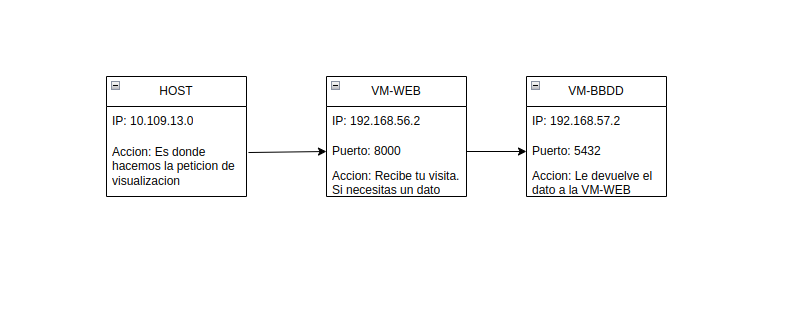

# Weekly Log - Proyect 1-DAW - 11/05/26

## 1. Participants

- Ivan Pérez González
- Daniel David Simoes Villalonga
- Mario González Martin
  
## 2. Theme Selection

We are going to develop a videogame's store.

Costumers will be able to choose from a bast variety of categories, such as, game gender, pc, console, etc.

## 3. GitHub Setup

We created a repo in which we will be publishin all the steps until the final post. In thi repository we will be uploading updates and every step that we take in the process of developing the store.

## 4. Data Source 

We have decided to use an API to get all the information related to the games that will fill our website.
We encountered other sources like [igdb](https://www.igdb.com/) or [steam](https://steam.com/) but we opted for [rawg.io](https://www.rawg.io/).
We chose this api because it contains all the info that we require to fill our site. Being thin info, game names, tags, images, videos, categories ,etc.

## 5. Scrapping Documentation

To make it short, scrapping is used to collect data from the internet and save it in a JSON file to use it.

The process changes a bit depending on which source you use to extract the data.

* Extraction from API's
  - In order to collect data from an API you need to make an HTTP request and save the answer.
  For the request is mandatory to use `request` library and `json` to save the file.

* Extraction from HTML (Web Scrapping)
  - To do this, you can choose between some libraries like `beautiful Soup`,          `Selenium` or `Playwright`.
  This works by identifing tags like `div`, `h1` or CSS classes, extracting the content or attributes and add them to a dictionary's list for it's later exportation into a `.json` file.

* Used references:
  - [datacamp](https://www.datacamp.com/es/tutorial/python-api,https://brightdata.es/blog/datos-web/api-requests-with-python)
  - [liora](https://liora.io/es/programacion-de-api-web-en-python-con-flask)

## 6. Safe Server Implementation and Two-Factor Authentication

We have chosen Github Pages for our deployment, which serves as a Static Site Hosting service that provides out-of-the-box HTTPS encryption. This ensures that the data transferred between the server and the user is encrypted, preventing 'man-in-the-middle' attacks.

To implement Two-Factor Authentication we are using a Client-Side Authentication layer such as Stastic or a similar JS framework. Since there is no traditional back-end server to validate credentials, the logic is handled by JavaScript in the user's browser, communicating with an external authentication provider.

However, because the site is static, all assets are delivered to the user, meaning that all data is tecnically  accesible.

## VM  Infrastucture Setup

To set up the enviroment, we created two Virtual Machines using VirtualBox with Linux Mint 21 (Cinnamon).

### 1. Hardware Configuration

Both VMs share the same base resources, with storage adjusted according to their specific roles:

- **RAM:** 4 GB
- **CPU:** 4 Cores
- **Storage (Web Server):** 15 GB
- **Storage (Database Server):** 25 GB
- **Network:** NAT Network to allow inter-VM communication and internet access.
   
### 2. OS Installation Process

- **Boot:** Load the Linux Mint ISO and select "Install Linux Mint" from the desktop icon.
- **Localization:** Keyboard layout set to Spanish and system language to English. 
- **Installation Type:** Selected "Erase disk and install Linux Mint" with the default partition scheme. 
- **user Credentials:**  
    - **User:** user
    - **Password:** 1234
    - **Hostname (Web):** user-web
    - **Hostname (DB):** user-BBDD 

### 3. Database Engine (PostgreSQL)

After the OS installation, we installed PostgreSQL on the user-BBDD machine using the official Ubuntu repository and the apt package manager.

## Architecture Diagram

We have designed a tiered architecture to isolate the data layer from the host machine.
The communication flow is established as follows in the next image:

### Data Flow

- **User/Host:** Accesses the Web Server via SSH or Browser.
- **Web Server:** Executes Python scripts to scrape data and sends the processed information to the Database Server.
- **Database Server:** Receives and stores data via port 5432.
  