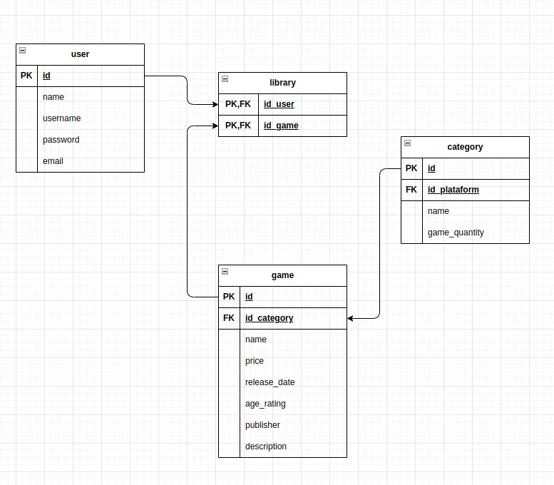
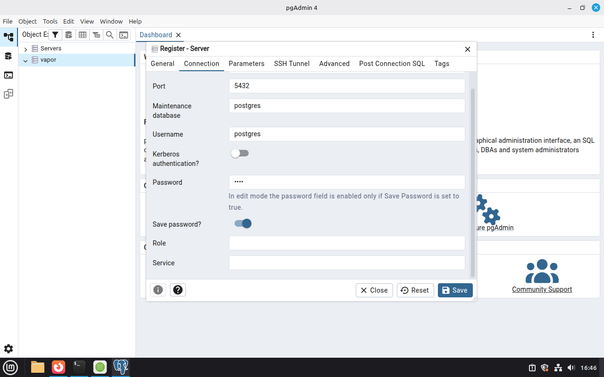
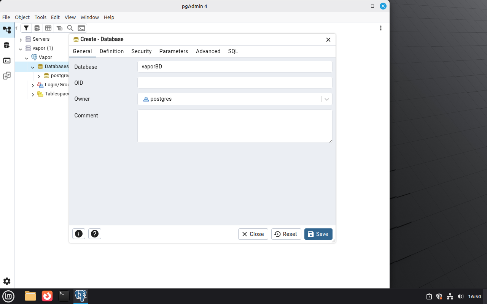
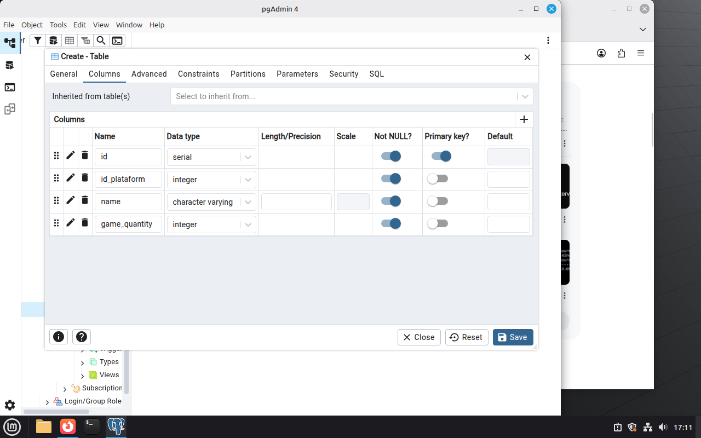
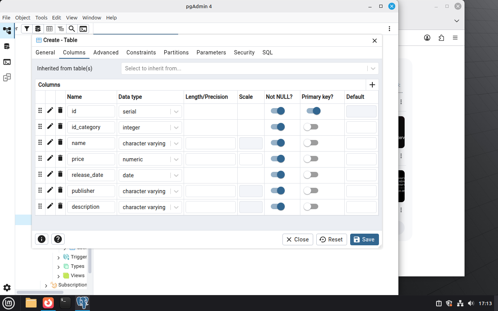
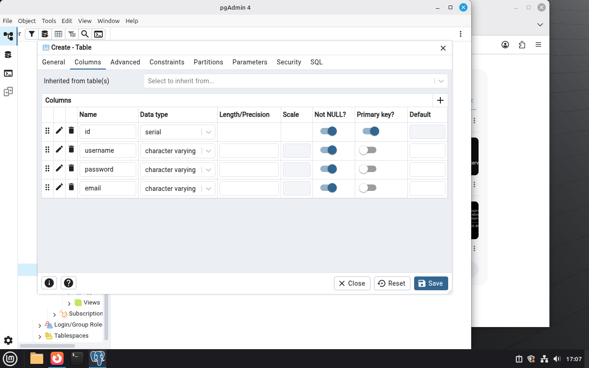

# Weekly Log - Proyect 1-DAW - 19/05/26

## Participants

- Ivan Pérez González
- Daniel David Simoes Villalonga
- Mario González Martin
 

## 1. PostgreSQL and PgAdmin4 Installation.
### PostgreSQL DBMS Installation

1. Package Update
* Update the package list before starting:
  ```bash
  sudo apt update
  ```

2. PostgreSQL Installation
* Install PostgreSQL and its additional utilities:
  ```bash
  sudo apt install postgresql postgresql-contrib -y
  ```

3. PostgreSQL User Password Assignment
* Access the PostgreSQL terminal interface:
  ```bash
  sudo -u postgres psql
  ```
* Modify the default user password:
  ```sql
  ALTER USER postgres PASSWORD 'example password';
  ```

### PgAdmin4 Database Administrator Installation

1. Public Key Installation
* Download and add the repository public key:
  ```bash
  curl -fsS https://pgadmin.org | sudo gpg --dearmor -o /usr/share/keyrings/packages-pgadmin-org.gpg
  ```

2. Official Repository Addition
* Add the official pgAdmin4 repository to the system sources:
  ```bash
  echo "deb [signed-by=/usr/share/keyrings/packages-pgadmin-org.gpg] https://postgresql.org\$(lsb_release -cs) pgadmin4 main" | sudo tee /etc/apt/sources.list.d/pgadmin4.list
  ```

3. Package Installation
* Update the package index again:
  ```bash
  sudo apt update
  ```
* Install the pgAdmin4 package (this installs both the desktop and web versions):
  ```bash
  sudo apt install pgadmin4 -y
  ```


## 2. Functional Requirements Definition.

**1. For Users (Players)**
+ **Account Registration:** Create individual profiles using an email and a unique password.
+ **Login:** Securely access profiles previously registered by the user.
+ **Game Catalog:** View an organized list featuring game covers, titles, and short descriptions.
+ **Search Filters:** Look up specific titles by categories, genre, or exact keywords.
+ **Game Execution:** Launch and play games directly in the browser using web technologies.

**2. For Administrators (Web Managers)**
+ **Control Panel:** Access an exclusive menu for the total management of the platform.
+ **Game Upload:** Publish new titles by uploading compressed files or external web links.
+ **Catalog Editing:** Modify titles, descriptions, or images of existing games.
+ **Content Removal:** Permanently remove titles from the web catalog.
+ **User Management:** Ban, suspend, or delete accounts that violate community guidelines.

## 3. DB Relational Model.

1. Entity Description
+ **user**: Stores credentials and personal profiles for registered players.
+ **game**: Contains detailed information about every video game available in the system.
+ **category**: Represents the genres or sections used to classify the games.
+ **library**: A many-to-many junction table linking users with their specific games.

2. Detailed Table Structure
+ **user** Table
    * `id` (PK): Unique auto-incremented identifier for each user.
    * `name`: Full name or display name of the user.
    * `username`: Unique nickname used for identification.
    * `password`: Encrypted security credential.
    * `email`: Unique email address for registration and recovery.

+ **game** Table
    * `id` (PK): Unique identifier for each video game.
    * `id_category` (FK): Reference link to the category table.
    * `name`: Commercial title of the videogame.
    * `price`: Retail cost of the game.
    * `release_date`: Official launching date.
    * `age_rating`: ESRB / PEGI classification code.
    * `publisher`: Company responsible for distribution.
    * `description`: Text summarizing the game characteristics.

+ **category** Table
    * `id` (PK): Unique identifier for the category.
    * `id_platform` (FK): External reference to a platform entity.
    * `name`: Name of the genre or category.
    * `game_quantity`: Counter tracker for games inside this category.

+ **library** Table
    * `id_user` (PK, FK): Composite key linking directly to the user table.
    * `id_game` (PK, FK): Composite key linking directly to the game table.




## 4. Definition and Creation of the DB using PgAdmin4. 

**1. Server Connection Configuration**
+ Open pgAdmin4, access "Register - Server", and configure the connection parameters:
    * Port: `5432`
    * Maintenance database / Username: `postgres`
    * Password: [Your master password] (Enable "Save password?")
+ Click **Save** to establish the server connection.


**2. Database Creation Management**
+ Right-click on "Databases" in the Object Explorer, and choose `Create` -> `Database...`.
+ Name the database `vaporBD` and assign the owner to `postgres`.
+ Click **Save** to create the database instance.


**3. Core Table Architectural Definitions**
Navigate to `Databases` -> `vaporBD` -> `Schemas` -> `public` -> `Tables`. For each table, right-click, select `Create` -> `Table...`, and configure the following columns:

+ **"category" Table**
    * `id`: `serial` (Not NULL, Primary Key)
    * `id_plataform`: `integer` (Not NULL)
    * `name`: `character varying` (Not NULL)
    * `game_quantity`: `integer` (Not NULL)

    

+ **"game" Table**
    * `id`: `serial` (Not NULL, Primary Key)
    * `id_category`: `integer` (Not NULL)
    * `name`: `character varying` (Not NULL)
    * `price`: `numeric` (Not NULL)
    * `release_date`: `date` (Not NULL)
    * `publisher`: `character varying` (Not NULL)
    * `description`: `character varying` (Not NULL)

    

+ **"library" Table**
    * `id_user`: `integer` (Not NULL, Primary Key)
    * `id_game`: `integer` (Nullable)

    

+ **"user" Table**
    * `id`: `serial` (Not NULL, Primary Key)
    * `username`: `character varying` (Not NULL)
    * `password`: `character varying` (Not NULL)
    * `email`: `character varying` (Not NULL)

    

+ Click **Save** after setting up each table layout to finalize the physical creation.

## 5. Net Configuration between DB and Web Server VM's.

### Virtual Network Infrastructure and Netplan Configuration

1. VirtualBox NAT Network Setup
+ Navigate to VirtualBox `Tools` -> `Network` -> `NAT Networks` and click **Create**.
+ Enable the **DHCP** checkbox to allow automatic IP leasing on this network segment.
+ Open the settings menu for both virtual machines (VMs) and configure two network interfaces:
    * **Adapter 1**: Set attached to `NAT Network` and select the name of the network created.
    * **Adapter 2**: Set attached to `Internal Network` (Ensure the network name matches identically on both VMs).
+ Power on both virtual machines simultaneously to begin network configuration.

1. Database Server Network Configuration
+ Identify the internal network interface name without an assigned IP by running:
  ```bash
  ip -br a
  ```
+ Open the Netplan configuration layout using the text editor:
  ```bash
  sudo nano /etc/netplan/01-netcfg.yaml
  ```
+ Define the permanent static IP configuration for the internal interface (`enp0s8`):
  ```yaml
  network:
    version: 2
    renderer: networkd
    ethernets:
      enp0s8:
        dhcp4: no
        addresses:
          - 192.168.10.12/24
  ```

1. Web Server Network Configuration
+ Edit the configuration script file on the web server instance:
  ```bash
  sudo nano /etc/netplan/01-netcfg.yaml
  ```
+ Apply DHCP auto-addressing on the NAT adapter (`enp0s3`) and a static IP on the internal link (`enp0s8`):
  ```yaml
  network:
    version: 2
    renderer: networkd
    ethernets:
      enp0s3:
        dhcp4: true
      enp0s8:
        dhcp4: no
        addresses:
          - 192.168.10.11/24
  ```

1. Connectivity and Network Validation
+ Apply the new network configuration on both servers:
  ```bash
  sudo netplan apply
  ```
+ Execute an ICMP network check to verify connection stability between both nodes:
  ```bash
  ping 192.168.10.11
  ```
